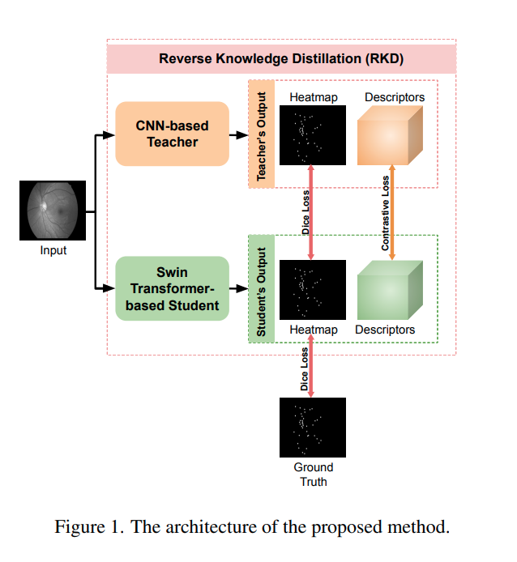

# Reverse Knowledge Distillation : Training a larger model with a smaller one. 

This repository contains the code and models for our paper. [Link to our paper](https://openaccess.thecvf.com/content/WACV2024/papers/Nasser_Reverse_Knowledge_Distillation_Training_a_Large_Model_Using_a_Small_WACV_2024_paper.pdf).
We would like to thank the authors of [Semi-Supervised Keypoint Detector and Descriptor for Retinal Image Matching](https://arxiv.org/abs/2207.07932) as this repository is built upon their code. Here is the [link](https://github.com/ruc-aimc-lab/SuperRetina) for their code.

## Representation of our pipeline



## Model Checkpoints
[Download the models here](https://drive.google.com/file/d/1iJ5BuXMSRofnztZOyJVdNxdnszHT9rXH/view?usp=sharing).
The models.zip contains three models : 
- SuperRetina.pth was trained by the authors of [Semi-Supervised Keypoint Detector and Descriptor for Retinal Image Matching](https://arxiv.org/abs/2207.07932)
- LKUNET.pth 
- SwinEncoder.pth 

Unzip this folder in your directory.

## Data files
[Download the data here](https://drive.google.com/file/d/1YWBi-xanw5ai8-R-jSoM8ns3vF09sF2K/view?usp=sharing)
The data.zip contains 2 folders : 
- Auxilliary_Training
- Our_data which contains retinal images with manual keypoint annotation

Apart from this, download [FIRE](https://projects.ics.forth.gr/cvrl/fire/) dataset and paste the folder inside the 'data' folder after extracting 'data.zip' file.

## Getting Started

We use python 3.8.16 for this implementation. For LKUNET.pth training, we used NVIDIA GeForce RTX 3090 whereas for the heavier models like SwinEncoder.pth, we used NVIDIA A100

Follow these steps to set up the repository on your local machine:
Note : In order to test the LKUNET.pth only, you can also create a conda environment with the file ./environment_lk.yml

1. Clone the repository:
    ```bash
    git clone https://github.com/NiharGupte/ReverseKnowledgeDistillation.git
    ```

2. Navigate to the project's root directory:
    ```bash
    cd ReverseKnowledgeDistillation
    ```

3. Create and activate the Conda environment:
    ```bash
    conda env create -f environment.yml
    conda activate SwinRetina
    ```
## Train and Test scripts

- Run test_on_FIRE.py after changing model configurations in config/test.yml 
- The training files for base model, LK model and swin model are provided in the respective train_base.py, train_lk.py and train_swin.py respectively
  
## Using Pretrained Models

You can use the models directly by changing the config/test.yml with the model path.

Note : We will soon be uploading the checkpoints and data format for the Facial keypoint validation which we used in our paper.

## Citations

If this repository helps you, please feel free to cite our paper
```
@inproceedings{nasser2024reverse,
  title={Reverse Knowledge Distillation: Training a Large Model using a Small One for Retinal Image Matching on Limited Data},
  author={Nasser, Sahar Almahfouz and Gupte, Nihar and Sethi, Amit},
  booktitle={Proceedings of the IEEE/CVF Winter Conference on Applications of Computer Vision},
  pages={7778--7787},
  year={2024}
}
```

## Contact

Please feel free to contact any of the authors in case of any issues
